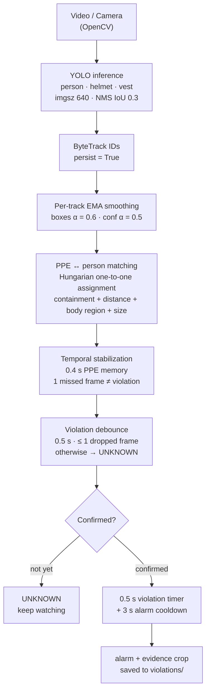

#  GurdianEYE

**AI-Based PPE Detection & Smart Safety Monitoring System**


GurdianEYE watches a video feed or camera stream and verifies that every detected worker is wearing a **helmet** and a **safety vest**. It matches each piece of PPE to the *right* person, classifies each worker's safety status, and — only once a violation is confirmed over time — raises an alarm and saves visual evidence.

**Features**

-  YOLO detection of `person` / `helmet` / `hardhat` / `vest` / `safety_vest`
-  Stable person IDs via ByteTrack (IoU pseudo-ID fallback)
-  One-to-one PPE↔person matching — Hungarian algorithm + containment + body-region analysis
-  Temporal stabilization — flicker-proof statuses (0.4 s PPE memory, 0.5 s violation debounce)
-  Alarms with 3 s cooldown and cropped evidence screenshots saved to `violations/`

> ⚠️ **Prototype.** Trained and tuned on practice videos. Validate with site-specific data before any real workplace use.

---

##  The Flow

Every frame passes through the same pipeline:



Same flow in plain text:

```text
┌─────────────┐   ┌─────────────┐   ┌─────────────┐   ┌─────────────┐
│ Video/Camera│──▶│ YOLO detect │──▶│ ByteTrack   │──▶│ EMA smooth  │
│ (OpenCV)    │   │ person      │   │ track IDs   │   │ box α=0.6   │
│             │   │ helmet/vest │   │ persist=True│   │ conf α=0.5  │
└─────────────┘   └─────────────┘   └─────────────┘   └──┬──────────┘
                                                         │
                                                         ▼
                                          ┌─────────────────────────────┐
                                          │ PPE ↔ person matching       │
                                          │ Hungarian one-to-one        │
                                          │ containment + distance      │
                                          │ + region & size priors      │
                                          └──────────────┬──────────────┘
                                                         │
                                                         ▼
                                          ┌─────────────────────────────┐
                                          │ Temporal stabilization      │
                                          │ (0.4 s PPE memory)          │
                                          └──────────────┬──────────────┘
                                                         │
                                                         ▼
                                          ┌─────────────────────────────┐
                                          │ Violation debounce (0.5 s)  │
                                          │ ≤ 1 dropped frame allowed   │
                                          └──────┬───────────────┬──────┘
                                                 │ not confirmed │
                                                 │ confirmed     │
                                                 ▼               ▼
                                        ┌───────────────┐ ┌───────────────┐
                                        │    UNKNOWN    │ │ ALARM + crop  │
                                        │(no alert yet) │ │ → violations/ │
                                        └───────────────┘ └───────────────┘
```

<!-- PART-B -->
### Stage by stage

1. **Detection** — a fine-tuned YOLO model (`models/best.pt`, imgsz 640, NMS IoU 0.3) finds `person`, `helmet`/`hardhat` and `vest`/`safety_vest` boxes in every frame. Duplicate boxes of the same object are merged with a lower NMS threshold (0.3).
2. **Tracking** — ByteTrack (`persist=True`) keeps a stable `track_id` per person; people that lose their tracker ID fall back to IoU-matched pseudo-IDs.
3. **Smoothing** — exponential moving average per track: α = 0.6 for bounding boxes, 0.5 for confidences. Boxes stop jittering without adding noticeable lag.
4. **PPE matching** — detections are split into persons / helmets / vests, then each helmet and vest is assigned to a worker with the **Hungarian algorithm** (`scipy.optimize.linear_sum_assignment`) over a weighted score:

   ```text
   score = 0.65 · containment(PPE inside person box)   # % of PPE box inside person
         + 0.35 · (1 − distance / person diagonal)     # proximity, size-normalized
         + body-region bonus                           # helmet → head, vest → torso
         + size-ratio prior                            # plausible PPE width vs person
   ```

   Containment is used instead of IoU because helmets and vests are far smaller than the person box — IoU collapses for small objects, containment does not.

5. **Temporal stabilization (0.4 s)** — the matcher remembers each worker's PPE for ~12 frames. If a helmet blinks out for a frame or two (motion blur, partial occlusion), it is carried forward instead of flipping a compliant worker to a violation.
6. **Violation debounce (0.5 s)** — a violation must persist ~15 frames with at most 1 dropped frame before it leaves `UNKNOWN`. Single-frame flicker never becomes an alarm.
7. **Safety monitor** — a confirmed violation runs a 0.5 s timer, triggers the alarm (3 s cooldown, 2 s re-arm, one alert per person) and saves a cropped screenshot of the violator to `violations/` as evidence.

##  Status classification

| Status | Meaning | System action |
|---|---|---|
| `SAFE` | helmet **and** vest matched | keep monitoring |
| `NO_HELMET` | vest matched, helmet missing | candidate violation → debounce |
| `NO_VEST` | helmet matched, vest missing | candidate violation → debounce |
| `CRITICAL_VIOLATION` | both missing | candidate violation → debounce |
| `UNKNOWN` | violation seen but not yet debounced | no alert yet |

##  Stabilization tricks

Detection alone flickers — the same worker can flip between `SAFE` and `NO_HELMET` frame by frame. These are the tricks that made the output stable:

| Trick | Where | Why it works |
|---|---|---|
| Per-track EMA on boxes & confidences (α = 0.6 / 0.5) | `detection/detector.py` | kills frame-to-frame jitter with no lag penalty |
| Containment instead of IoU for PPE | `ppe_matcher.py` | small objects (helmets, vests) keep a meaningful score |
| Hungarian one-to-one assignment | `ppe_matcher.py` | correct PPE↔person pairing when workers cluster together |
| Body-region + size priors | `ppe_matcher.py` | a helmet at **head height** scores higher than one at torso height |
| 0.4 s PPE memory | `ppe_matcher.py` | one missed detection never becomes a violation |
| 0.5 s debounce (≤ 1 dropout) | `ppe_matcher.py` | flicker can't reach the alarm stage |
| 3 s alarm cooldown + 2 s re-arm + per-person dedup | `safety_monitor.py` | no alarm spam, no repeat alerts for the same worker |
| Lower NMS IoU (0.3) | `main.py` | merges duplicate boxes of the same object |
| Frame-edge truncation flag (5 px margin) | `ppe_matcher.py` | partially visible people are marked in the evidence |

##  Getting started

```bash
git clone https://github.com/Engshadow/GurdianEYE.git
cd GurdianEYE
pip install ultralytics opencv-python scipy numpy
python main.py
```

Defaults (video source, model path, thresholds) live in the config block at the top of [`main.py`](main.py) — swap `videos/test5.mp4` for your own clip or a webcam index.

**Controls:** `q` quit · `p` pause/resume · click the on-screen **STOP** button.

##  Key configuration

| Parameter | Value | Where |
|---|---|---|
| Inference size / NMS IoU | 640 px / 0.30 | `main.py` |
| Detector confidence | 0.25 | `main.py` |
| Person / PPE confidence | 0.45 / 0.30 | `ppe_matcher.MatcherConfig` |
| Match thresholds | containment ≥ 0.35 · score ≥ 0.35 | `ppe_matcher.MatcherConfig` |
| EMA alphas (boxes / conf) | 0.6 / 0.5 | `detection/detector.py` |
| Temporal stabilization | 0.4 s ≈ 12 frames @ 30 fps | `timing.py` |
| Violation debounce | 0.5 s ≈ 15 frames, ≤ 1 dropout | `timing.py` |
| Violation timer / alarm cooldown / re-arm | 0.5 s / 3 s / 2 s | `safety_monitor.py` |

##  Tuning (offline replay)

EMA (24), ranked by violation recall/precision, alert latency and flicker rate.

Adopted settings: `filter_seconds = 0.5` — the knee of the curve, where flicker and false alerts are roughly **halved** vs a 0.2 s filter — plus `stability_seconds = 0.4`, `violation_seconds = 0.5`, imgsz **640**.

Full methodology, sweep tables and the alert audit: **[TUNING_REPORT.md](TUNING_REPORT.md)**.

##  Project structure

```text
GurdianEYE/
├── main.py                  # entry point: frame loop, overlay UI, config
├── detection/
│   └── detector.py          # YOLO inference + ByteTrack + EMA smoothing
├── ppe_matcher.py           # PPE↔person matching + temporal stabilization + debounce
├── safety_monitor.py        # violation timers, alarms, evidence crops, zones
├── timing.py                # seconds → frames timing config (FPS-aware)
├── models/                  # YOLO weights (best.pt, ppe_yolo11s_fet004.pt, …)
├── tuning/                  # offline replay & sweeps (see TUNING_REPORT.md)
│   ├── cache_detections.py  #   cache YOLO output once (GPU)
│   ├── replay.py            #   replay cached detections through matcher/monitor
│   ├── sweep.py             #   hyperparameter grids (timing/conf/geometry/EMA)
│   └── …                    #   GT helpers, event export, metrics
├── videos/                  # test videos (gitignored)
├── violations/              # saved evidence crops
└── TUNING_REPORT.md         # tuning methodology + findings
```

##  Demo & evidence

The live overlay shows each worker's bounding box and PPE status with an FPS counter; confirmed violations are saved as cropped screenshots in `violations/` (filename includes person ID, violation type and timestamp).


## License

Released under the [Apache License 2.0](LICENSE).


